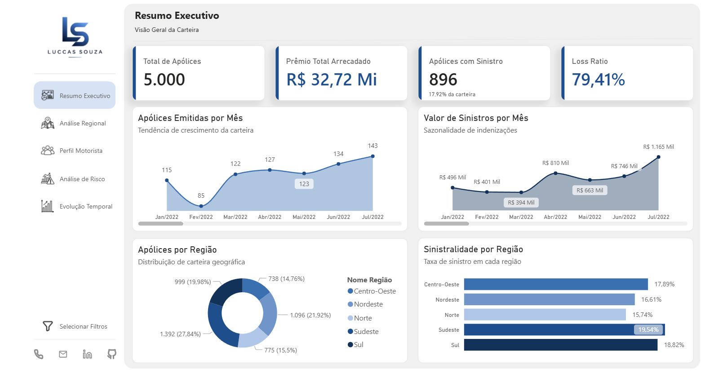
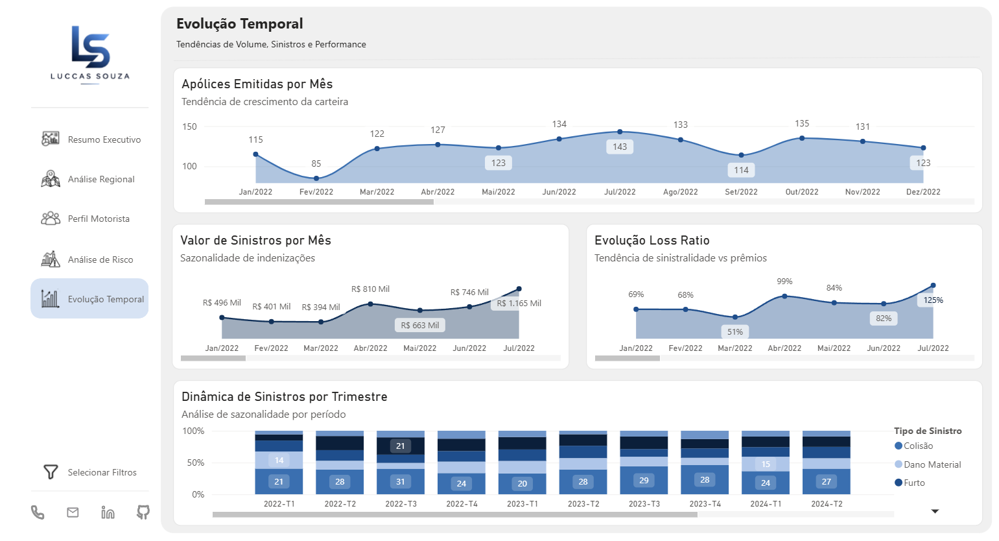
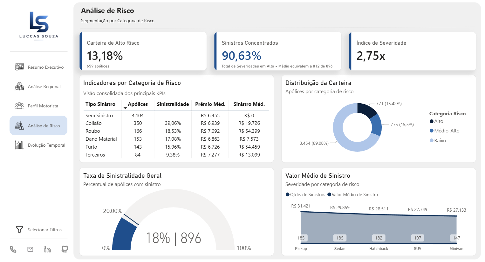

# Seguros Automotivos: Documentação Técnica

**Autor:** Luccas Souza | Analista de Dados | **Data:** 03/05/2026

🔗 [Acessar Dashboard no Power BI](https://app.powerbi.com/view?r=eyJrIjoiNTY2NGI2N2ItN2UwYi00Y2IxLTlhOTQtODI1YTU4MmI5YmI1IiwidCI6IjgxY2I0YzMxLWRiOTUtNDcxNC1hYzhjLTRkMzAwNmVjZjRiMCJ9)

## 1. Visão Geral

Este dashboard foi desenvolvido para proporcionar análise exploratória e multidimensional de carteiras de seguros automotivos, focando em sinistralidade, perfil de risco e performance de prêmios. O objetivo é transformar dados operacionais brutos em inteligência acionável para gestores, atuários e analistas.

O modelo responde a perguntas críticas do negócio: quem está realmente em risco? Onde estão concentradas as perdas? Como precificar adequadamente? Qual é a dinâmica temporal de sinistros? O dashboard estrutura 5 mil apólices em um modelo Star Schema que permite exploração multidimensional com precisão e performance.

O escopo cobre análise de sinistralidade por região geográfica, perfil demográfico do motorista, categoria de risco assegurada, tipo de sinistro e evolução temporal. Cada dimensão pode ser cruzada para identificar padrões, anomalias e oportunidades de otimização.



## 2. Fonte de Dados

**Dataset:** Seguros Automotivos - Análise de Sinistralidade
**Origem:** 100% sintético, gerado via script Python (NumPy/Pandas, seed=42)
**Organização:** Luccas Souza | Portfólio de Dados
**Data:** 03/05/2026
**Idioma:** Português Brasileiro

> ⚠️ **Nota de transparência:** Este dataset foi criado exclusivamente para fins de portfólio. Os parâmetros de distribuição (taxa de sinistralidade 17,9%, Loss Ratio 79%, distribuição de tipos de sinistro) foram calibrados para refletir ordens de grandeza plausíveis do mercado brasileiro de seguros automotivos, mas **não derivam de dados reais publicados** por SUSEP, CNseg ou qualquer outra entidade reguladora. Toda análise deve ser tratada como demonstração técnica, não como benchmark de mercado.

**Características do dataset:**

Total de registros: 5.000 apólices
Total de atributos: 13 colunas
Período coberto: Janeiro 2022 a Abril 2025 (39 meses)
Taxa de sinistralidade: 17,9% (896 apólices com sinistro)

**Atributos originais:**

O dataset contém as seguintes colunas: ID_Apólice (identificador único), Data_Emissão (período de análise), Região (Norte, Nordeste, Centro-Oeste, Sudeste, Sul), Idade_Motorista (18-74 anos), Anos_CNH (experiência em habilitação, 0-49 anos), Tipo_Veículo (Sedan, SUV, Hatchback, Pickup, Minivan), Valor_Veículo (em reais), Prêmio_Mensal (em reais), Categoria_Risco (Baixo, Médio-Alto, Alto), Teve_Sinistro (0 ou 1), Tipo_Sinistro (Colisão, Roubo, Furto, Dano Material, Terceiros, Sem Sinistro), Valor_Sinistro (em reais) e Taxa_Sinistralidade (percentual).

## 3. Modelo de Dados

**Arquitetura:** Star Schema com uma tabela de fatos centralizada e cinco dimensões normalizadas.

**Rationale:** O Star Schema foi escolhido por sua simplicidade de implementação no Power BI, performance em queries multidimensionais, facilidade de manutenção futura e alinhamento com padrões de negócio de seguros. Alternativas como Snowflake Schema foram consideradas mas rejeitadas pela complexidade adicional sem benefício proporcional para este caso de uso.

### Tabela de Fato: F_Sinistros

Armazena um registro por apólice com seus atributos de prêmio, exposição e sinistralidade.

**Granularidade:** Uma linha por apólice (nível máximo de detalhe)
**Chave Primária:** ID_Apólice
**Tamanho:** 5.000 registros

**Colunas de fato:**

ID_Apólice (inteiro, chave única) identifica a apólice de forma única. Prêmio_Mensal (moeda) registra o valor mensal cobrado pela apólice. Valor_Veículo (moeda) armazena o valor do bem segurado no momento da emissão. Teve_Sinistro (binário 0/1) indica ocorrência de sinistro. Valor_Sinistro (moeda) registra o montante total de indenizações pagas. Taxa_Sinistralidade (decimal) expressa a relação percentual entre sinistro e valor do veículo.

**Chaves estrangeiras:**

Data_Emissão_ID liga a tabela de fatos à dimensão temporal. Região_ID conecta ao contexto geográfico. Motorista_ID vincula aos atributos demográficos do principal segurado. Veículo_ID relaciona ao tipo e segmento do bem. Sinistro_ID conecta à categorização de sinistros.

### Dimensão 1: D_Tempo

Proporciona contexto temporal para análises de sazonalidade, tendências e evolução de carteira.

**Chave Primária:** Data_Emissão_ID (chave surrogate)
**Colunas:** Data_Emissão (data completa), Ano (2022-2025), Trimestre (Q1-Q4), Mês (1-12), Mês_Nome (Janeiro-Dezembro), Dia_Semana (Segunda-Domingo), Semana_Ano (1-52)

**Uso:** Análises temporais de volume de apólices emitidas, sazonalidade de sinistros, evolução de Loss Ratio, dinâmica trimestral e identificação de períodos anômalos.

### Dimensão 2: D_Região

Segmenta a carteira por contexto geográfico brasileiro.

**Chave Primária:** Região_ID (chave surrogate 1-5)
**Colunas:** Nome_Região (Norte, Nordeste, Centro-Oeste, Sudeste, Sul), Sigla (N, NE, CO, SE, S), Número_Estados (quantidade de estados na região)

**Uso:** Análise de sinistralidade regional, identificação de mercados com maiores perdas, benchmarking de performance por localidade, estratégia de precificação geográfica.

### Dimensão 3: D_Motorista

Caracteriza o perfil demográfico e de experiência do principal segurado.

**Chave Primária:** Motorista_ID (chave surrogate)
**Colunas:** Idade_Motorista (18-74), Faixa_Etária (18-25, 26-35, 36-50, 51-65, 65+), Anos_CNH (0-49), Experiência (Novato 0-2 anos, Intermediário 2-10 anos, Experiente 10+ anos), Categoria_Risco (Baixo, Médio-Alto, Alto)

**Uso:** Análise de correlação entre perfil demográfico e sinistralidade, segmentação de estratégia de marketing, identificação de grupos de alto risco, modelagem preditiva de comportamento.

### Dimensão 4: D_Veículo

Caracteriza o bem segurado por tipo e faixa de valor.

**Chave Primária:** Veículo_ID (chave surrogate)
**Colunas:** Tipo_Veículo (Sedan, SUV, Hatchback, Pickup, Minivan), Valor_Veículo (valor em reais), Faixa_Valor (Até 30k, 30-60k, 60-100k, 100k+), Segmento (Econômico, Intermediário, Premium)

**Uso:** Análise de sinistralidade por tipo veículo, identificação de bens com maior exposição de risco, estratégia de precificação baseada em segmento, correlação entre valor do bem e frequência/severidade de sinistro.

### Dimensão 5: D_Sinistro

Caracteriza a natureza e ocorrência de sinistros.

**Chave Primária:** Sinistro_ID (chave surrogate 1-6)
**Colunas:** Teve_Sinistro (0 ou 1), Tipo_Sinistro (Sem Sinistro, Colisão, Roubo, Furto, Dano Material, Terceiros), Severidade (Nenhuma, Baixa, Média, Alta)

**Uso:** Análise de distribuição de tipos de sinistro, identificação de padrões de reclamação, avaliação de severidade por categoria, dinâmica temporal de ocorrências.

### Diagrama de Relacionamentos

```
                    ┌─────────────┐
                    │   D_Tempo   │
                    │─────────────│
                    │ PK Data_ID  │
                    │ Data_Emissão│
                    │ Ano         │
                    │ Trimestre   │
                    │ Mês         │
                    └──────┬──────┘
                           │ N:1
          ┌────────────┐   │   ┌──────────────┐
          │  D_Região  │   │   │  D_Motorista │
          │────────────│   │   │──────────────│
          │ PK Região_ID   │   │ PK Motorista_ID
          │ Nome_Região│   │   │ Faixa_Etária │
          │ Sigla      │   │   │ Anos_CNH     │
          └─────┬──────┘   │   │ Categoria_Risco
                │ N:1      │   └──────┬───────┘
                │          │          │ N:1
                │    ┌─────┴──────────┴────────────────────────┐
                └───►│              F_Sinistros                │◄───┐
                     │       (Fato · 5.000 registros)          │    │
                     │─────────────────────────────────────────│    │
                     │ PK  ID_Apólice                          │    │
                     │ FK  Data_Emissão_ID                     │    │
                     │ FK  Região_ID                           │    │
                     │ FK  Motorista_ID                        │    │
                     │ FK  Veículo_ID                          │    │
                     │ FK  Sinistro_ID                         │    │
                     │     Prêmio_Mensal                       │    │
                     │     Valor_Veículo                       │    │
                     │     Teve_Sinistro                       │    │
                     │     Valor_Sinistro                      │    │
                     │     Taxa_Sinistralidade                 │    │
                     └───────────────┬─────────────────────────┘    │
                                     │                              │
                          ┌──────────┘                              │
                          │ N:1                                 N:1 │
                   ┌──────┴──────┐                       ┌──────────┴──┐
                   │  D_Veículo  │                       │  D_Sinistro │
                   │─────────────│                       │─────────────│
                   │ PK Veículo_ID                       │ PK Sinistro_ID
                   │ Tipo_Veículo│                       │ Tipo_Sinistro
                   │ Faixa_Valor │                       │ Severidade  │
                   │ Segmento    │                       └─────────────┘
                   └─────────────┘
```

Todos os relacionamentos seguem cardinalidade **N:1** (Many-to-One), padrão em Star Schema. As dimensões filtram a tabela fato, nunca o contrário.

## 4. Catálogo de Medidas DAX

As medidas foram organizadas em 6 grupos funcionais: KPIs principais, análise dimensional, série temporal, categoria de risco, carteira de alto risco e complementares.

### Grupo 1: KPIs Principais

**Total de Apólices** = COUNTA(F_Sinistros[ID_Apólice])
Contagem total de apólices no período. Métrica de volume base.

**Prêmio Total Arrecadado** = SUMX(F_Sinistros, F_Sinistros[Prêmio_Mensal] * 12)
Receita total esperada em 12 meses. Indicador de receita do portfólio.

**Apólices com Sinistro** = CALCULATE(COUNTA(F_Sinistros[ID_Apólice]), FILTER(F_Sinistros, F_Sinistros[Teve_Sinistro] = 1))
Contagem de apólices que geraram sinistro. Volume absoluto de ocorrências.

**Taxa de Sinistralidade Geral** = DIVIDE([Apólices com Sinistro], [Total de Apólices], 0) * 100
Percentual de apólices com sinistro. Métrica crítica de risco (esperado 15-20%).

**Valor Total de Sinistros** = SUM(F_Sinistros[Valor_Sinistro])
Somatório de indenizações pagas. Exposição financeira total.

**Loss Ratio** = DIVIDE([Valor Total de Sinistros], [Prêmio Total Arrecadado], 0) * 100
Percentual de sinistros vs prêmios. Métrica central de rentabilidade (saudável abaixo de 100%, esperado 60-80% em seguros auto).

**Taxa de Sinistralidade Geral (Texto)** = FORMAT([Taxa de Sinistralidade Geral] / 100, "0.0%")
Versão formatada em texto da taxa de sinistralidade geral. Usada em cards de contexto e tooltips para exibição amigável sem casas decimais excessivas.

**Índice de Severidade** = DIVIDE([Valor Total de Sinistros], CALCULATE(SUM(F_Sinistros[Valor_Veículo]), FILTER(F_Sinistros, F_Sinistros[Teve_Sinistro] = 1)), 0)
Razão entre o valor total indenizado e o valor total dos veículos sinistrados. Mede a proporção da perda em relação ao bem segurado.

### Grupo 2: Análise Dimensional

**Sinistralidade por Região** = DIVIDE(CALCULATE(COUNTA(F_Sinistros[ID_Apólice]), FILTER(F_Sinistros, F_Sinistros[Teve_Sinistro] = 1)), CALCULATE(COUNTA(F_Sinistros[ID_Apólice])), 0) * 100
Taxa de sinistro segmentada por região geográfica.

**Prêmio Médio por Faixa Etária** = AVERAGE(F_Sinistros[Prêmio_Mensal])
Prêmio médio mensal agrupado por faixa etária. Mostra diferenciação de precificação.

**Sinistro Médio por Tipo Veículo** = AVERAGEX(VALUES(D_Veículo[Tipo_Veículo]), CALCULATE(AVERAGE(F_Sinistros[Valor_Sinistro]), FILTER(F_Sinistros, F_Sinistros[Teve_Sinistro] = 1)))
Valor médio de sinistro por tipo de veículo (apenas apólices com sinistro).

**Distribuição de Sinistros por Tipo** = CALCULATE(COUNTA(F_Sinistros[ID_Apólice]), FILTER(F_Sinistros, F_Sinistros[Teve_Sinistro] = 1))
Contagem de sinistros segmentados por tipo (colisão, roubo, etc).

**Faixa Idade Motorista** = SELECTEDVALUE(D_Motorista[Faixa_Etária], "Todas as Faixas")
Retorna o valor selecionado da faixa etária no contexto de filtro ativo, ou o texto padrão quando nenhuma seleção está ativa. Usada em cards de contexto para exibir dinamicamente qual faixa etária está sendo analisada.

### Grupo 3: Série Temporal

**Apólices Emitidas por Mês** = COUNTA(F_Sinistros[ID_Apólice])
Volume de apólices emitidas agrupadas por mês. Mostra tendência de crescimento.

**Valor de Sinistros por Mês** = SUM(F_Sinistros[Valor_Sinistro])
Soma cumulativa de sinistros por mês. Identifica sazonalidade de indenizações.

**Evolução Loss Ratio** = DIVIDE([Valor de Sinistros por Mês], SUM(F_Sinistros[Prêmio_Mensal]), 0) * 100
*(No contexto de filtro mensal do visual, SUM(Prêmio_Mensal) já é mensal. Multiplicar por 12 causaria inconsistência entre numerador e denominador.)*
Tendência do Loss Ratio ao longo do tempo. Alerta se Loss Ratio cresce.

**Sinistralidade** = DIVIDE(CALCULATE(COUNTA(F_Sinistros[ID_Apólice]), F_Sinistros[Teve_Sinistro] = 1), COUNTA(F_Sinistros[ID_Apólice]), 0)
Versão simplificada da taxa de sinistralidade sem multiplicação por 100. Retorna valor decimal (ex: 0,179) para uso em visuais de linha temporal onde o eixo Y é formatado diretamente como percentual pelo Power BI. Evita conflito de escala quando combinada com outros indicadores no mesmo eixo.



### Grupo 4: Categoria de Risco

**Sinistralidade por Categoria de Risco** = DIVIDE(CALCULATE(COUNTA(F_Sinistros[ID_Apólice]), FILTER(F_Sinistros, F_Sinistros[Teve_Sinistro] = 1)), CALCULATE(COUNTA(F_Sinistros[ID_Apólice])), 0) * 100
Taxa de sinistro por nível de risco (Alto, Médio-Alto, Baixo).

**Apólices por Categoria de Risco** = COUNTA(F_Sinistros[ID_Apólice])
Distribuição de apólices por categoria de risco. Mostra composição da carteira.

**Prêmio Médio por Categoria de Risco** = AVERAGE(F_Sinistros[Prêmio_Mensal])
Prêmio médio por nível de risco. Mostra diferenciação de precificação.

### Grupo 5: Carteira de Alto Risco

**Qtd Carteira Alto Risco** = CALCULATE(COUNTA(F_Sinistros[ID_Apólice]), D_Motorista[Categoria_Risco] = "Alto")
Contagem absoluta de apólices classificadas como categoria de risco Alto. Insumo direto para o KPI de concentração de risco na carteira.

**% Carteira Alto Risco** = DIVIDE([Qtd Carteira Alto Risco], [Total de Apólices], 0)
Percentual da carteira composta por apólices de alto risco. Indicador de concentração de risco.

**Sinistros Concentrados %** = DIVIDE(CALCULATE([Valor Total de Sinistros], D_Motorista[Categoria_Risco] = "Alto"), [Valor Total de Sinistros], 0)
Percentual do valor total de sinistros originado por apólices de alto risco. Mede a concentração financeira das perdas nesse segmento. Se a proporção de sinistros concentrados superar significativamente o % Carteira Alto Risco, indica que o risco está subprecificado.

**Sinistros Concentrados (Debug)** = CALCULATE([Valor Total de Sinistros], D_Motorista[Categoria_Risco] = "Alto")
Valor absoluto de sinistros de alto risco sem divisão. Versão de diagnóstico da medida [Sinistros Concentrados %], usada para validar o numerador isoladamente durante desenvolvimento e revisão do modelo.



### Grupo 6: Complementares

**Valor Médio do Veículo** = AVERAGE(F_Sinistros[Valor_Veículo])
Valor médio dos veículos segurados. Contexto de exposição.

**Idade Média do Motorista** = AVERAGE(F_Sinistros[Idade_Motorista])
Idade média dos segurados principais. Fator de risco importante.

**Experiência Média** = AVERAGE(F_Sinistros[Anos_CNH])
Tempo médio de habilitação em anos. Fator de risco inverso.

## 5. Decisões de Arquitetura

**Escolha de Star Schema:** Prioriza performance, simplicidade e intuitividade sobre normalização máxima. Adequado para análise ad-hoc e exploração rápida.

**Chaves Surrogate:** Implementadas em todas as dimensões para independência de mudanças na fonte e otimização de joins. Chaves naturais (como ID_Apólice) mantidas apenas quando iguais à chave de negócio.

**Granularidade:** Uma linha por apólice (máximo detalhe) permite drill-down até nível de apólice individual e flexibilidade para futuras agregações.

**Desnormalização Estratégica:** Apenas campos calculados foram desnormalizados (Faixa_Etária, Experiência, Faixa_Valor, Severidade). Facilita uso no Power BI sem impactar manutenibilidade.

**Histórico de Dados:** Snapshot sem versionamento temporal. Futuras evoluções podem implementar Slowly Changing Dimension Type 2 (SCD2) se necessário rastrear mudanças de categoria de risco ou outras dimensões.

**Particionamento:** Não implementado na versão v1. Com crescimento para volumes acima de 50M registros, considerar particionamento por ano de Data_Emissão.

**Agregações Incrementais:** Não necessárias na v1. Com volumes acima de 20M registros, considerar agregações pré-calculadas por Mês/Região/Categoria_Risco.

## 6. Glossário

**Apólice:** Contrato de seguro entre a seguradora e o segurado. Cada linha na tabela de fatos representa uma apólice única.

**Prêmio:** Valor pago pelo segurado à seguradora em troca de cobertura. No dataset, registrado como valor mensal.

**Sinistro:** Evento coberto pela apólice que gera direito a indenização (colisão, roubo, furto, dano material ou responsabilidade civil).

**Taxa de Sinistralidade:** Razão entre o valor indenizado e o valor do bem segurado, expressa em percentual. Indica proporção relativa da perda.

**Loss Ratio (Índice de Sinistralidade):** Razão entre o valor total de sinistros e a receita total de prêmios, expressa em percentual. Métrica de rentabilidade (ideal abaixo de 100%).

**Categoria de Risco:** Classificação da apólice em Alto, Médio-Alto ou Baixo baseada em perfil de motorista e histórico de sinistros.

**Exposição:** Valor total dos bens segurados em risco de perda. No caso de seguros auto, o valor total dos veículos segurados.

**Sazonalidade:** Padrão recorrente de variação ao longo do tempo (mensal, trimestral, anual) observado em volume de apólices ou sinistros.

**Faixa_Etária:** Agrupamento de idades em faixas discretas (18-25, 26-35, etc) para facilitar análise de padrões por cohort.

**Experiência:** Classificação de tempo de habilitação em Novato (0-2 anos), Intermediário (2-10 anos) e Experiente (10+ anos).

## 7. Contato

- 📧 luccasnsouza1@gmail.com
- 🔗 [linkedin.com/in/luccas-souza7](https://linkedin.com/in/luccas-souza7)
- 💻 [github.com/luccas-souza7](https://github.com/luccas-souza7)
- 📱 [+55 11 93201-8859](https://wa.me/5511932018859)

**Documentação atualizada em:** 03/05/2026
